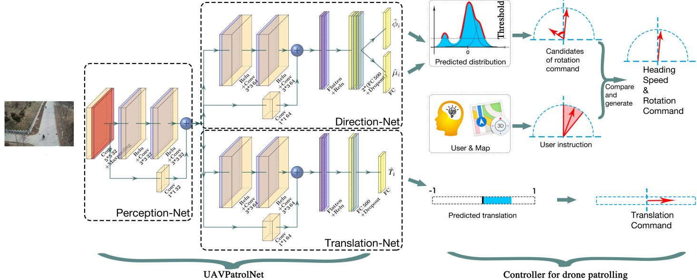

### Learn by Observation: Imitation Learning for Drone Patrolling from Videos of A Human Navigator

Project: [Original github repository](https://github.com/uzh-rpg/rpg_public_dronet)

## Introduction
### Background
For instance,
some current works on drone patrolling rely heavily on the map, which raises an issue: many maps are inaccurate for patrolling applications as the roads in the map are not perfectly aligned with the real roads. Consequently, the drone is likely to fly off the right track. Some other drone navigation methods based on deep learning do not need maps and train navigation neural networks with data collected from cameras mounted on cars or carried by people.As a result, these works are only suitable for drones that fly several meters off the ground and use a forward-facing onboard camera with a limited view inadequate for autonomous patrolling. Also, they lack the ability to turn to the desired direction at crossroads. Therefore, these neural networks can only make the drone go along the direction with the minimum rotation angle.
### Our works
We first present a method for automatically creating and annotating a dataset, namely Patrol Dataset that records human’s patrolling behavior for IL. This method is especially suitable for high-flying drone patrolling.

We also present a network. The proposed IL network is named UAVPatrolNet which includes three sub-networks: Perception-Net, Direction-Net and Translation-Net. The drone first utilizes the PerceptionNet to extract features from a single image. Then, instead of constantly going along the direction with the minimum rotation angle at a crossroad, the drone relies on the Direction-Net, essentially a Mixture Density Network (MDN), to predict the probabilities of all possible road directions. 

### Network


### Dataset
#### Raw data
```
train_dir/
    collection1/
        images/
    collection2/
    collection3/
    ...
validation_dir/
    validationset1/
        images/
    ...
test_dir/
    testingset1/
        images/
    ...
```
#### After auto-labeling 
```
train_dir/
    collection1/*
        images/
        direction_n_filted.txt or translation.txt
    collection2/
    collection3/
    ...
validation_dir/
    validationset1/
        images/
        direction_n_filted.txt or translation.txt
    ...
test_dir/
    testingset1/
        images/
    ...
```
## Get Start

### Requirements
Our environment is Ubuntu 18.04 and python3.6

Dependencies:
* TensorFlow 1.15.0
* Keras 2.2.4
* Keras-contrib 2.0.8
* tensorflow-estimator         
* tensorflow-probability          
* tensorflow-tensorboard
* NumPy
* OpenCV
* scikit-learn
* Python gflags

### Usage
   Set parameter at `common_flag.py`,parameter has `Epoch`,`training_dir, validation_dir and experiment_dir`,`pretrained model`,`batch_size` or add args `python cnn.py [Args]`

## Reference
Project: [Original github repository](https://github.com/uzh-rpg/rpg_public_dronet)

Paper: [DroNet:Learning to Fly by Driving](http://rpg.ifi.uzh.ch/docs/RAL18_Loquercio.pdf)

Video: [YouTube](https://youtu.be/ow7aw9H4BcA)

```
@article{Loquercio_2018,
   doi = {10.1109/lra.2018.2795643},
   year = 2018,
   author = {Antonio Loquercio and Ana Isabel Maqueda and Carlos R. Del Blanco and Davide Scaramuzza},
   title = {Dronet: Learning to Fly by Driving},
   journal = {{IEEE} Robotics and Automation Letters}
}
```